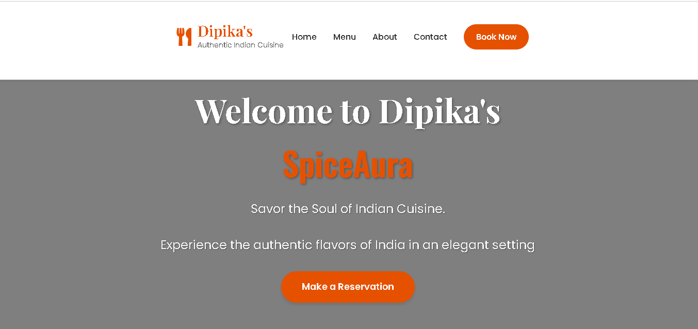
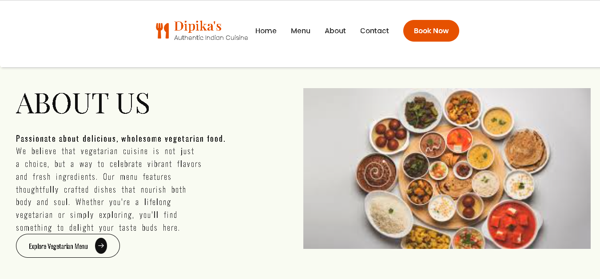
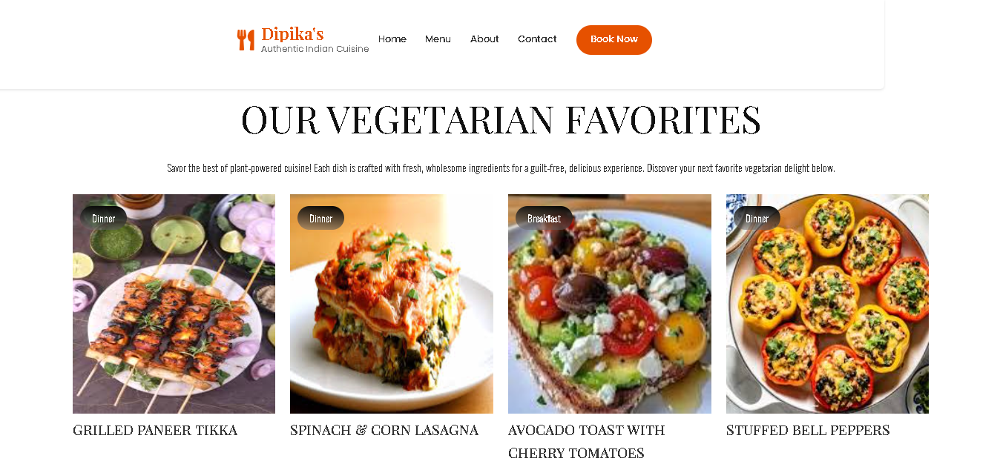
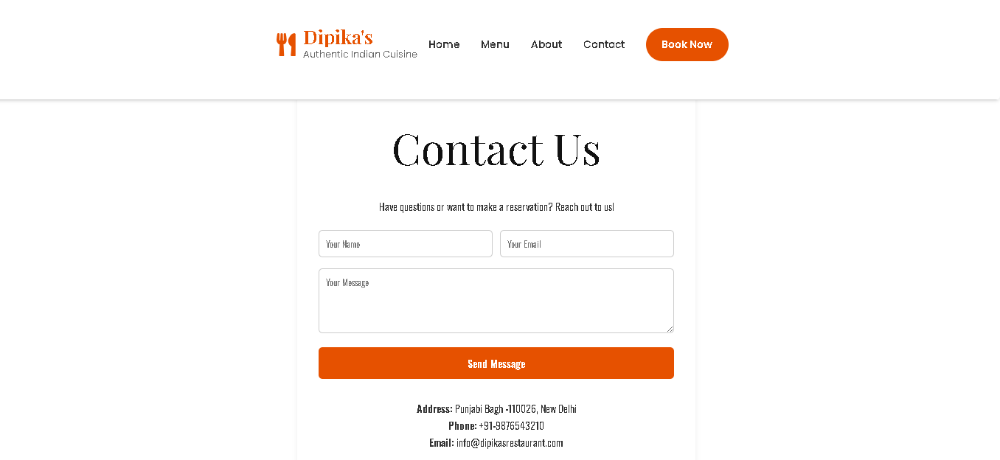
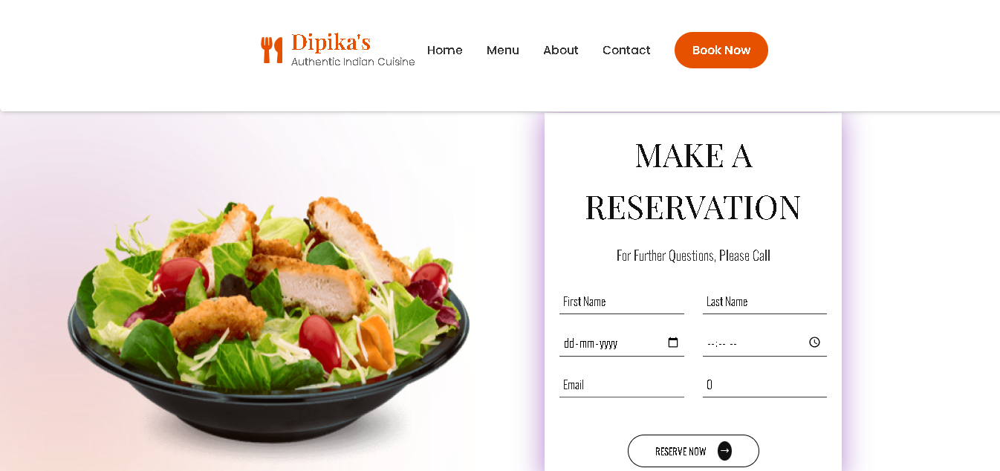

# MERN Stack Restaurant Reservation System

A full-stack restaurant reservation web application built with the MERN stack (MongoDB, Express, React, Node.js).

## Features
- Modern, responsive UI for Dipika's Restaurant
- Online table reservation form
- Menu, About, and Contact pages
- Toast notifications for actions
- MongoDB Atlas cloud database
- Ready for deployment on Render (backend) and Vercel (frontend)

## Tech Stack
- **Frontend:** React, styled-components, react-router-dom, Vite
- **Backend:** Node.js, Express, Mongoose
- **Database:** MongoDB Atlas
- **Deployment:** Vercel (frontend), Render (backend)

## Screenshots






## Getting Started

### Prerequisites
- Node.js & npm
- MongoDB Atlas account (for cloud database)

### Local Setup
1. **Clone the repository:**
   ```bash
   git clone https://github.com/Dipikagithub123/Mern-stack-restaurant-reservation-system.git
   cd Mern-stack-restaurant-reservation-system
   ```
2. **Install backend dependencies:**
   ```bash
   cd backend
   npm install
   ```
3. **Install frontend dependencies:**
   ```bash
   cd ../frontend
   npm install
   ```
4. **Set up environment variables:**
   - In `backend/.env`, add:
     ```
     MONGO_URI=your_mongodb_atlas_uri
     ```
5. **Run the backend:**
   ```bash
   cd ../backend
   npm start
   ```
6. **Run the frontend:**
   ```bash
   cd ../frontend
   npm run dev
   ```
7. **Visit the app:**
   - Frontend: [http://localhost:5173](http://localhost:5173)
   - Backend: [http://localhost:4000](http://localhost:4000)

## Deployment

### Backend (Render)
- Push your code to GitHub.
- Create a new Web Service on [Render](https://render.com/).
- Set build command: `npm install`
- Set start command: `npm start`
- Add environment variable: `MONGO_URI`
- Deploy and note your backend URL.

### Frontend (Vercel)
- Push your code to GitHub.
- Import your frontend folder as a new project on [Vercel](https://vercel.com/).
- Update API URLs in frontend to use your Render backend URL.
- Deploy and note your frontend URL.

## License

This project is open source and available under the [MIT License](LICENSE).

---

**Developed by Dipika Tiwari** 
